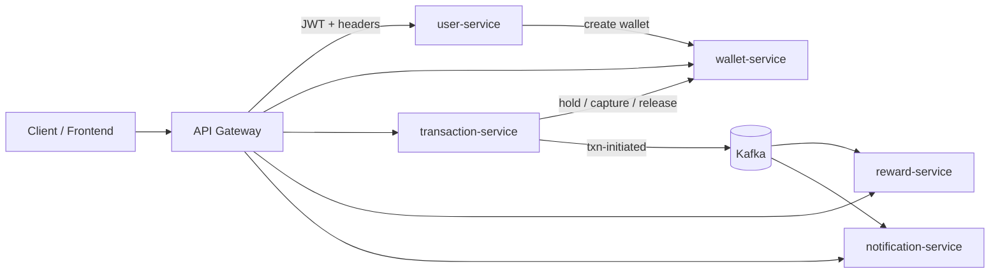
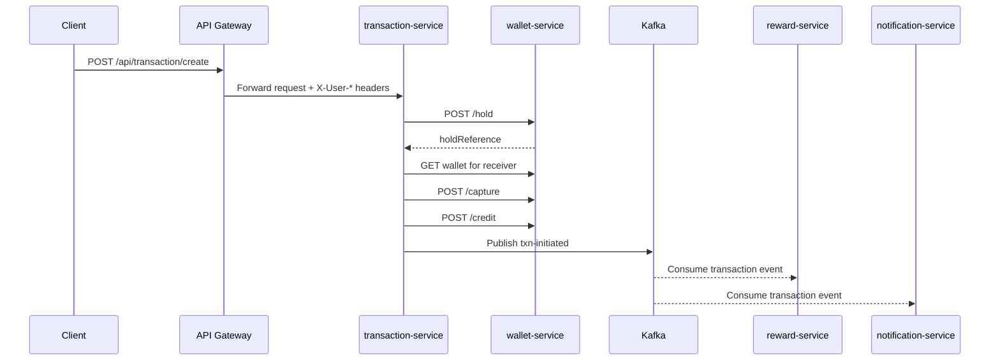
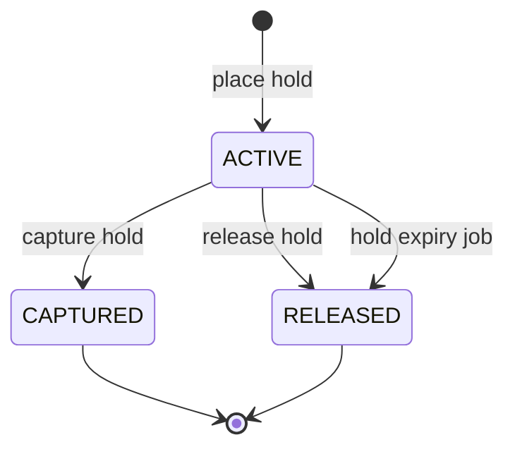

# NexPay -  Microservices-Based Distributed Payment Platform

NexPay is a Spring Boot microservices backend for digital wallet transfers, transaction orchestration, rewards, and notifications. The system uses Spring Cloud Gateway for request routing and JWT enforcement, Kafka for event-driven communication, PostgreSQL for persistent data storage, and a wallet hold-capture-release workflow to maintain transaction consistency across services. The application is containerized with Docker and deployed on AWS EC2 using Docker Compose.

## Project overview

The backend is split into six services:

| Service | Port | Responsibility |
|---|---:|---|
| api-gateway | 8080 | Routes requests, validates JWTs, injects user headers, applies CORS and rate limiting |
| user-service | 8081 | User registration, login, JWT issuance, and wallet creation orchestration |
| transaction-service | 8082 | Transfer orchestration, wallet hold/capture/release coordination, Kafka publishing |
| notification-service | 8083 | Consumes transaction events and stores user notifications |
| reward-service | 8084 | Consumes transaction events and stores reward records |
| wallet-service | 8085 | Wallet CRUD, credit/debit operations, holds, captures, and releases |

> Each microservice owns its own PostgreSQL database, ensuring data isolation, loose coupling, and independent scalability.

## Key features

- JWT-based authentication and gateway-level request filtering
- API Gateway routing with Redis-backed rate limiting
- User signup and login with password hashing
- Automatic wallet creation when a user registers
- Wallet balance management with `availableBalance` separation
- Hold-capture-release workflow for safer transfers
- Saga-style compensation when downstream steps fail
- Kafka-based event publishing and consumption
- Reward generation for successful transactions
- Transaction notifications persisted per user
- Database-per-service architecture with dedicated PostgreSQL databases for persistent data storage
- Dockerized microservices deployed on AWS EC2 using Docker Compose
  
## Architecture

### Request flow

## Tech stack

| Layer | Technologies |
|---|---|
| Language | Java 17 |
| Framework | Spring Boot, Spring Web, Spring Security |
| API Gateway | Spring Cloud Gateway, WebFlux, JWT, Redis |
| Data | Spring Data JPA, PostgreSQL |
| Messaging | Apache Kafka, Spring Kafka |
| Service-to-service calls | Spring Cloud OpenFeign, RestTemplate |
| Build | Maven |
| Deployment | Docker, Docker Compose, AWS EC2 |

## Microservices

### API Gateway

- Routes public authentication and protected service endpoints
- Validates JWT Bearer tokens
- Applies Redis-backed rate limiting to selected routes
- Enforces CORS policies

### User service

- `POST /auth/signup`
- `POST /auth/login`
- `POST /api/users`
- `GET /api/users/{id}`
- `GET /api/users/all`

On signup, the service persists the user and calls the wallet service through Feign to create the initial wallet.

### Wallet service

- `POST /api/wallets`
- `POST /api/wallets/credit`
- `POST /api/wallets/debit`
- `GET /api/wallets/{userId}`
- `POST /api/wallets/hold`
- `POST /api/wallets/capture`
- `POST /api/wallets/release/{holdReference}`

The wallet service stores:

- `Wallet` records with `balance` and `availableBalance`
- `WalletHold` records with `ACTIVE`, `CAPTURED`, and `RELEASED` states
- `Transaction` ledger entries

It also includes a scheduled scanner that releases expired holds.

### Transaction service

- `POST /api/transaction/create`
- `GET /api/transaction/{id}`
- `GET /api/transaction/user/{userId}`

This service orchestrates the transfer saga:

1. Persist the transaction as `PENDING`
2. Place a hold on the sender wallet
3. Confirm the receiver wallet exists
4. Capture the hold from the sender
5. Credit the receiver wallet
6. Mark the transaction as `SUCCESS`
7. Publish the completed transaction to Kafka on `txn-initiated`

If a downstream step fails, the service attempts to release the hold and marks the transaction `FAILED`.

### Reward service

- `GET /api/rewards`
- `GET /api/rewards/user/{userId}`

Consumes `txn-initiated` Kafka events and creates a reward entry for the sender. Reward points are calculated from the transaction amount.

### Notification service

- `POST /api/notify`
- `GET /api/notify/{userId}`

Consumes `txn-initiated` Kafka events and stores a notification for the sender.

## Hold-capture-release workflow

The wallet flow is the core consistency mechanism:

- **Hold**: reserves funds by reducing `availableBalance`
- **Capture**: finalizes the debit once the transfer can proceed
- **Release**: returns reserved funds to `availableBalance`
- **Expiry**: the scheduler can release stale active holds automatically

## Future improvements

- Configure automated CI/CD pipelines for production deployments
- Add idempotency keys and retry policies for transfer requests
- Standardize DTOs and shared contracts across services
- Add observability with centralized logs, metrics, and tracing